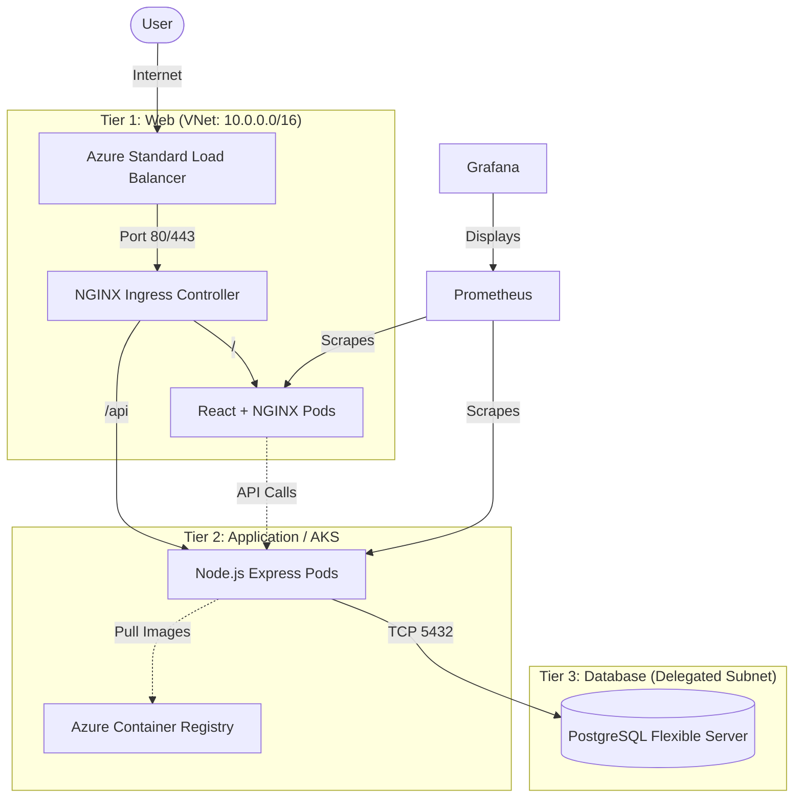

# 🚀 TaskFlow: Three-Tier DevOps Challenge

Welcome to the **TaskFlow** project. This repository contains a production-grade microservice deployment using modern DevOps practices and tools, fulfilling the 7-day DevOps challenge requirements.

---

## 🏗️ Architecture & Tech Stack

This project implements a classic Three-Tier Architecture, containerized and deployed on Azure Kubernetes Service (AKS) using Infrastructure as Code (OpenTofu).

**Tech Stack:**
- **Infrastructure:** OpenTofu (Terraform), Azure (VNet, AKS, ACR, Load Balancer, PostgreSQL Flexible Server)
- **Frontend (Tier 1):** React, TypeScript, Vite, NGINX 
- **Backend (Tier 2):** Node.js, Express, `pg` driver
- **Database (Tier 3):** Azure Database for PostgreSQL Flexible Server 16
- **Deployment:** Docker, Helm, Kubernetes (AKS)
- **CI/CD:** GitHub Actions
- **Observability:** Prometheus & Grafana (via `kube-prometheus-stack` Helm dependency)

### Architecture Diagram



---

## 🛠️ Step 1: Infrastructure as Code (OpenTofu)

The infrastructure is fully defined as code in the `opentofu/` directory.

### Prerequisites:
- `tofu` (OpenTofu CLI) installed.
- `az` (Azure CLI) installed and logged in (`az login`).
- Azure Subscription.

### Deployment Steps:

1. **Configure Variables:**
   ```bash
   cp opentofu/terraform.tfvars.example opentofu/terraform.tfvars
   ```
   Edit `terraform.tfvars` and provide a secure **password** for the database and your **SSH public key**.

2. **Provision Infrastructure:**
   ```bash
   cd opentofu
   tofu init
   tofu plan
   tofu apply -auto-approve
   ```

3. **Grant Role Assignments (Manual step due to SP constraints):**
   ```bash
   # Grant AcrPull to AKS Kubelet
   KUBELET_ID=$(az aks show -g scg-dev-rg -n scg-dev-aks --query identityProfile.kubeletidentity.objectId -o tsv)
   ACR_ID=$(az acr show -g scg-dev-rg -n scgdevacr --query id -o tsv)
   az role assignment create --assignee $KUBELET_ID --role AcrPull --scope $ACR_ID
   ```

---

## 🔁 Step 2: CI/CD Pipeline (GitHub Actions)

The CI/CD pipeline is defined in `.github/workflows/deploy.yml` and triggers automatically on pushes to the `main` branch.

### CI/CD Workflow:
1. **Azure Login:** Authenticates using Service Principal.
2. **Build & Push:** Uses `docker buildx` to build and tag images with the Git commit SHA, then pushes them to the Azure Container Registry (`scgdevacr.azurecr.io`).
3. **Deploy (Helm):** Configures `kubectl` context, dynamically updates Helm values with the new image tags and injected database secrets, and runs `helm upgrade --install`.

### Setup Actions Secrets:
Before pushing code, create the following secrets in your GitHub Repository settings:
- `AZURE_CREDENTIALS`: JSON output of `az ad sp create-for-rbac --name "github-actions" --role contributor...`
- `DB_PASSWORD`: The exact password you set for PostgreSQL in `terraform.tfvars`.

---

## ☸️ Step 3: Kubernetes Deployment (Helm)

The Kubernetes manifests are packaged into a Helm chart located at `k8s/helm/taskflow`.

**Features of the Helm Chart:**
- **Prometheus Stack Dependency:** Automatically installs Prometheus, Grafana, and AlertManager alongside the app.
- **Secrets Management:** Injects the Database password securely from GitHub Actions into Kubernetes Secrets (`templates/backend-secret.yaml`).
- **Ingress Rule:** Single Load Balancer routing `/api` to the backend and `/` to the frontend (`templates/ingress.yaml`).
- **Probes:** Configured Liveness and Readiness probes for zero-downtime rolling updates.

*(To view it manually without GitHub Actions)*:
```bash
az aks get-credentials --resource-group scg-dev-rg --name scg-dev-aks
helm dependency update k8s/helm/taskflow
helm upgrade --install taskflow ./k8s/helm/taskflow --set database.password="<YOUR_DB_PASSWORD>"
```

---

## 📈 Observability (Monitoring & Logging)

By integrating the `kube-prometheus-stack` into the Helm Chart, the AKS cluster is fully observable from minute one.

### Accessing Grafana Dashboards
Once the Helm chart is deployed, access the Grafana dashboard via port-forwarding:

```bash
kubectl port-forward svc/taskflow-grafana 3000:80
```
- Open `http://localhost:3000`
- **Username:** `admin`
- **Password:** `admin` (Default set in `values.yaml`)

### What is Monitored?
- **Node Resources:** CPU, Memory, Disk usage across the `system` and `user` AKS node pools.
- **Pod Health:** Restart rates, memory limits, and liveness probe failures for the `taskflow-backend` and `taskflow-frontend`.
- **Kubernetes State:** Cluster-level metrics via `kube-state-metrics`.

*(Additionally, Azure Monitor / Container Insights is enabled at the infrastructure level via OpenTofu for control-plane logs).*